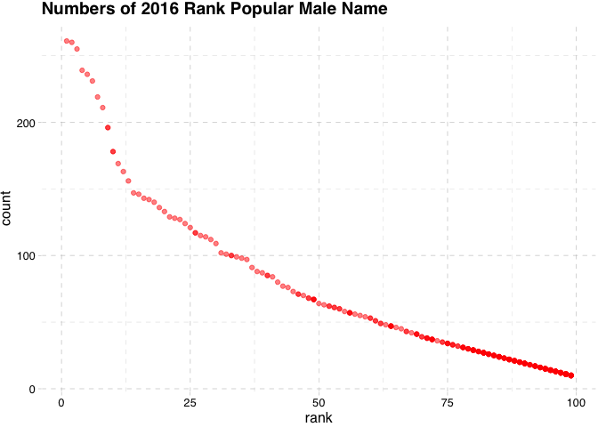

hw2
================
Hao Zheng(hz2772)
10/3/2021

**Problem 1**

``` r
trash_data = 
  read_excel("data/Trash-Wheel-Collection-Totals-7-2020-2.xlsx",
             sheet = "Mr. Trash Wheel"
             ) %>%
  janitor::clean_names() %>%
  select(dumpster:homes_powered) %>%
  drop_na(dumpster) %>%
  mutate(sports_balls=round(sports_balls))

precip18_data = 
  read_excel("data/Trash-Wheel-Collection-Totals-7-2020-2.xlsx",
             sheet = "2018 Precipitation",
             range = "A2:B14") %>%
  janitor::clean_names() %>%
  tidyr::drop_na(total) %>%
  mutate(year = 2018)

precip19_data = 
  read_excel("data/Trash-Wheel-Collection-Totals-7-2020-2.xlsx",
             sheet = "2019 Precipitation",
             range = "A2:B14") %>%
  janitor::clean_names() %>%
  tidyr::drop_na(total) %>%
  mutate(year = 2019) 

precip_data = 
  union(precip18_data,precip19_data) %>%
  pivot_wider(names_from = "year",
              values_from = "total") %>%
  mutate(month=month.name)
## description
skimr::skim(trash_data)
skimr::skim(precip_data)
```

The **“Trash-Wheel”** dataframe has 454 rows and 14 columns which are 14
variables named dumpster, month, year and etc. Like the number of glass
bottles in the dumpster 1 in May is 72. The **median number of sports
balls in dumpster of 2019** is 9.

The **precipitation** dataframe of 2018 and 2019 has 12 rows and 3
columns which are 3 variables named month, 2018 and 2019. The values are
precipitation data of each month. Like the precipitation data in May of
2018 is 9.27. The **total precipitation of 2018** is 70.33.

**Problem2**

``` r
pm_df = read.csv("data/fivethirtyeight_datasets/pols-month.csv") %>%
  separate(col=mon,into = c("year","month","day"),sep = "-") %>%
  mutate(month=replace(month,month==c("01","02","03","04","05","06","07","08","09","10","11","12"),month.name)) %>%
  mutate(president=prez_gop+prez_dem) %>%
  select(-prez_dem)  %>%
  select(-prez_gop)  %>%
  select(-day) %>%
  mutate(year=as.integer(year))

snp_df = read.csv("data/fivethirtyeight_datasets/snp.csv") %>%
  separate(col=date,into = c("month","day","year"),sep = "/") %>%
  mutate(month = month.name[as.integer(month)]) %>%
  select(year,month,everything()) %>%
  mutate(year = ifelse(as.integer(year)>=50,as.integer(year)+1900,as.integer(year)+2000)) 

une_df = read.csv("data/fivethirtyeight_datasets/unemployment.csv") %>%
  pivot_longer(Jan:Dec,
               names_to="month",
               values_to="une_data") %>%
  rename(year=Year) %>%
  mutate(month=replace(month,month==month.abb,month.name))

mer_df = merge(x=snp_df,y=pm_df,by=c("year","month"),all.y = TRUE) 
mer_df = merge(x=une_df,y=mer_df,by.x=c("year","month"),all.y = TRUE)

skimr::skim(pm_df)
skimr::skim(snp_df)
skimr::skim(une_df)
```

**The pols-month data** has 822 rows and 9 columns, with 9 variables
named month, year, gov\_gop and etc. The values are from each year and
each month from 1947 to 2015. Like the gov\_gop value in May of 1998 is
32.

**The snp data** has 787 rows and 4 columns, with 4 variables named
month, day, year and close. The values are from each year and each month
from 1950 to 2015. Like the close value in May of 1998 is 1090.819946.

**The unemployment data** has 816 rows and 3 columns, with 3 variables
named month, year and une\_data. The values are from each year and each
month from 1948 to 2015. Like the unemployment value in May of 1998 is
4.4.

**Problem 3**

``` r
pbn_df = read_csv("data/Popular_Baby_Names.csv") 
pbn_df = pbn_df[!duplicated(pbn_df),] %>%
  janitor::clean_names() %>%
  ## find some ethnicity categories changed
  mutate(ethnicity=replace(ethnicity,ethnicity=="ASIAN AND PACI","ASIAN AND PACIFIC ISLANDER")) %>%
  mutate(ethnicity=replace(ethnicity,ethnicity=="BLACK NON HISP","BLACK NON HISPANIC")) %>%
  mutate(ethnicity=replace(ethnicity,ethnicity=="WHITE NON HISP","WHITE NON HISPANIC")) 
         

olv_df = filter(pbn_df,childs_first_name=="Olivia",gender=="FEMALE") %>%
  select(-gender,-childs_first_name,-count) %>%
  pivot_wider(names_from = "year_of_birth",
              values_from = "rank")
olv_df
```

    ## # A tibble: 4 × 5
    ##   ethnicity                  `2016` `2015` `2014` `2013`
    ##   <chr>                       <dbl>  <dbl>  <dbl>  <dbl>
    ## 1 ASIAN AND PACIFIC ISLANDER      1      1      1      3
    ## 2 BLACK NON HISPANIC              8      4      8      6
    ## 3 HISPANIC                       13     16     16     22
    ## 4 WHITE NON HISPANIC              1      1      1      1

``` r
pop_male_df = filter(pbn_df,gender=="MALE",rank==1) %>%
  select(-gender,-count,-rank) %>%
  pivot_wider(names_from = "year_of_birth",
              values_from = "childs_first_name")

plot_df = filter(pbn_df,year_of_birth==2016,gender=="MALE",ethnicity=="WHITE NON HISPANIC") 
pop_male_df
```

    ## # A tibble: 4 × 7
    ##   ethnicity                  `2016` `2015` `2014` `2013` `2012` `2011` 
    ##   <chr>                      <chr>  <chr>  <chr>  <chr>  <chr>  <chr>  
    ## 1 ASIAN AND PACIFIC ISLANDER Ethan  Jayden Jayden Jayden RYAN   ETHAN  
    ## 2 BLACK NON HISPANIC         Noah   Noah   Ethan  Ethan  JAYDEN JAYDEN 
    ## 3 HISPANIC                   Liam   Liam   Liam   Jayden JAYDEN JAYDEN 
    ## 4 WHITE NON HISPANIC         Joseph David  Joseph David  JOSEPH MICHAEL

``` r
ggplot(plot_df,aes(x=rank,y=count)) + 
  geom_point(alpha=.5,color=rainbow(length(rank)))+
  ggtitle("Numbers of 2016 Rank Popular Male Name")+
  theme_pander()
```

<!-- -->
